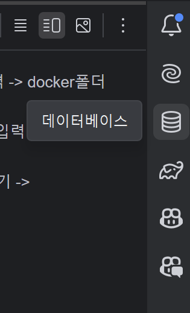
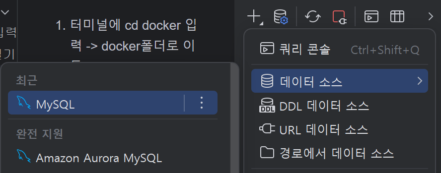
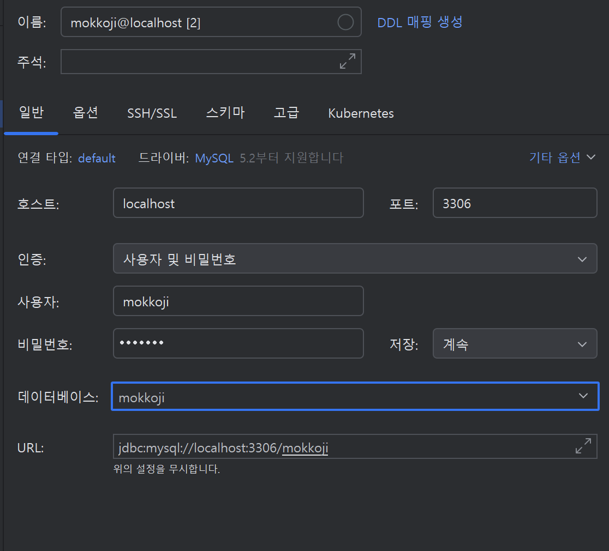
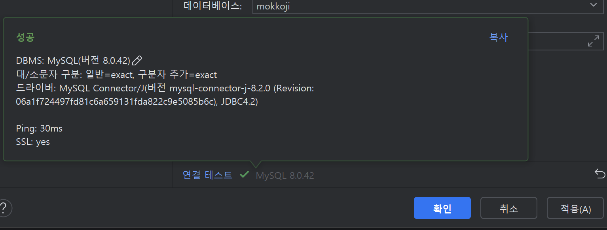

## 반드시 "docker desktop"은 켜둬야함

1. 터미널에 cd docker 입력 -> docker폴더로 이동
2. docker-compose up -d 입력 -> docker 실행
## 반드시 "docker desktop"에서 mysql컨테이너가 실행중이어야함

3.intellij 데이터 베이스 열기 

4. "+" 누르고 데이터 소스 mysql 선택

5. 사용자 비밀번호 데이터 베이스에 모두 mokkoji라고 입력하기

6. "Test Connection" 버튼을 눌러서 연결이 잘 되는지 확인하기

